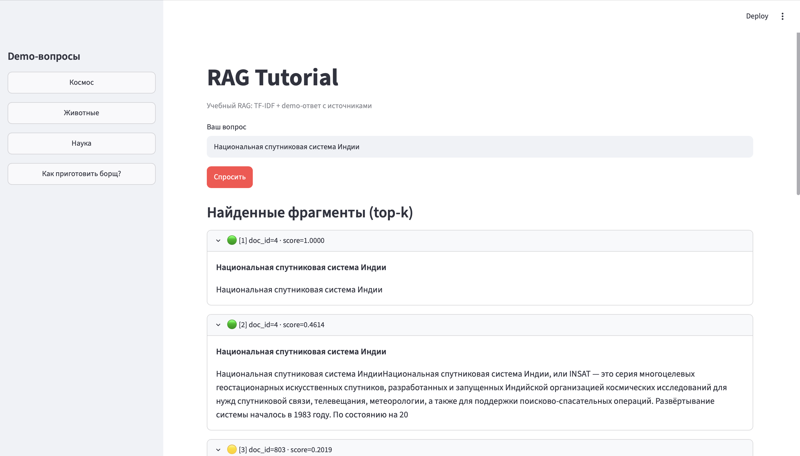
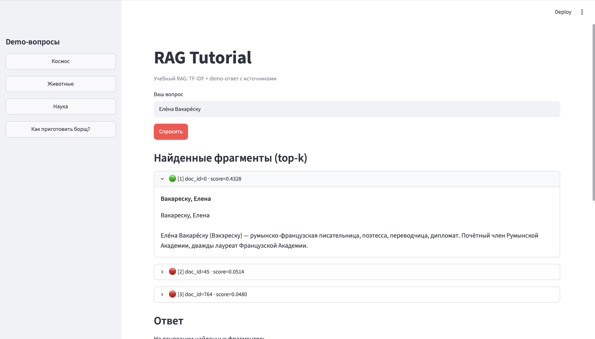
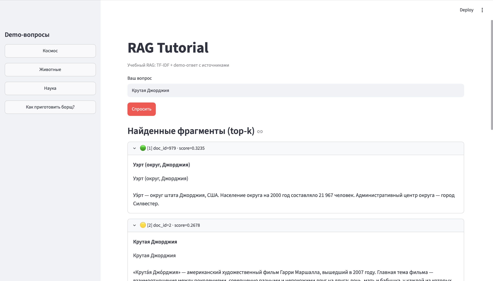
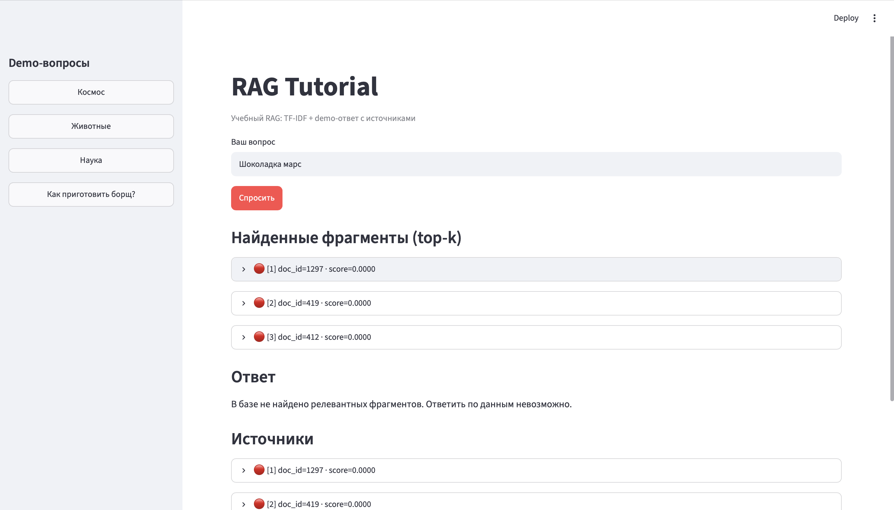

# RAG Tutorial: Поиск по Википедии

Учебный RAG на TF-IDF: данные → чанки → индекс → поиск → ответ.

## Быстрый старт

```bash
uv sync
uv run python scripts/build_index.py
uv run streamlit run app/main.py
```
Данные

Источник: Русская Википедия
Объем: 1297 документов (1617 чанков)
Демо-вопросы

Вопрос	Ожидание
Космос	ответ + источник
Животные	ответ + источник
Наука	ответ + источник
Как приготовить борщ?	отказ
Улучшения

🟢/🟡/🔴 Цветные индикаторы
🇷🇺 Русскоязычный интерфейс
## Скриншоты работы

### Поиск "Космос"


### Поиск "Животные"


### Поиск "Наука"


### Negative-запрос "Как приготовить борщ?" (отказ)

